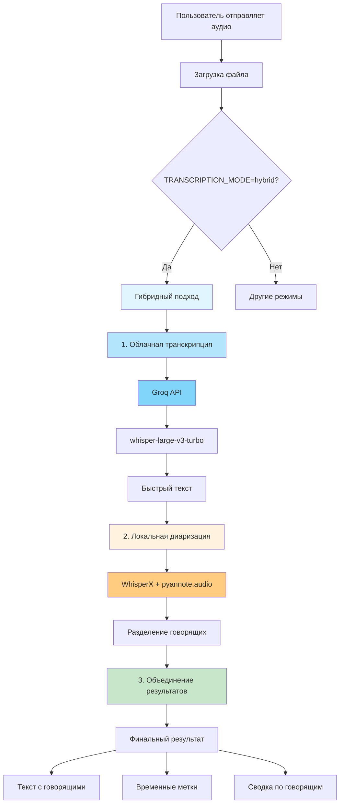

# Гибридный подход: Облачная транскрипция + Локальная диаризация

## Схема работы



## Преимущества гибридного подхода

### ⚡ Скорость
- **Облачная транскрипция**: Быстрая обработка через Groq API
- **Локальная диаризация**: Только для разделения говорящих (быстрее полной обработки)

### 🎯 Качество
- **Высокое качество транскрипции**: Whisper Large v3 Turbo
- **Точная диаризация**: WhisperX + pyannote.audio
- **Разделение говорящих**: Полная функциональность

### 💰 Экономия ресурсов
- **Меньше нагрузки на сервер**: Транскрипция в облаке
- **Оптимизированная диаризация**: Только необходимые операции

## Этапы обработки

### Этап 1: Облачная транскрипция (30%)
1. Отправка аудио в Groq API
2. Использование модели whisper-large-v3-turbo
3. Получение качественного текста

### Этап 2: Локальная диаризация (70%)
1. Анализ аудио для определения говорящих
2. Привязка текста к говорящим
3. Создание временных меток

### Этап 3: Объединение (100%)
1. Синхронизация результатов
2. Форматирование вывода
3. Создание сводки

## Настройки

```env
# Гибридный режим
TRANSCRIPTION_MODE=hybrid

# Облачная транскрипция
GROQ_API_KEY=your_groq_api_key
GROQ_MODEL=whisper-large-v3-turbo

# Локальная диаризация
ENABLE_DIARIZATION=true
```

## Fallback логика

Если облачная транскрипция недоступна:
1. Автоматический переход к локальной транскрипции
2. Сохранение диаризации
3. Полная функциональность

## Производительность

- **Время транскрипции**: ~30-50% от полной локальной обработки
- **Качество**: Эквивалентно полной локальной обработке
- **Ресурсы**: Значительно меньше нагрузки на сервер
