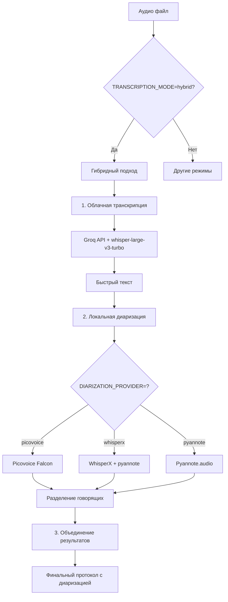

# Гибридный режим с Picovoice: Как это работает

## 🎯 Вопрос: Какой сервис диаризации будет использоваться при `TRANSCRIPTION_MODE=hybrid` и `DIARIZATION_PROVIDER=picovoice`?

**Ответ: Picovoice Falcon будет использоваться для диаризации в гибридном режиме.**

## 📊 Схема работы гибридного режима



## 🔧 Детальный процесс обработки

### Этап 1: Облачная транскрипция (30% времени)
```python
# 1. Проверка размера файла
if file_size <= 25MB:
    # Отправка в Groq API
    transcription = await groq_client.transcribe(file_path)
else:
    # Fallback на локальную транскрипцию
    transcription = whisper_model.transcribe(file_path)
```

### Этап 2: Локальная диаризация (70% времени)
```python
# 2. Применение диаризации к аудио файлу
if DIARIZATION_PROVIDER == "picovoice":
    diarization_result = await picovoice_service.diarize_file(file_path)
elif DIARIZATION_PROVIDER == "whisperx":
    diarization_result = whisperx_service.diarize_file(file_path)
elif DIARIZATION_PROVIDER == "pyannote":
    diarization_result = pyannote_service.diarize_file(file_path)
```

### Этап 3: Объединение результатов (100%)
```python
# 3. Синхронизация текста с диаризацией
result = {
    "transcription": transcription,  # Текст из Groq API
    "diarization": diarization_result,  # Говорящие из Picovoice
    "speakers_text": speakers_text,  # Текст по говорящим
    "formatted_transcript": formatted_transcript  # "SPEAKER_1: текст"
}
```

## 🎯 Конкретный ответ на ваш вопрос

### При настройках:
```env
TRANSCRIPTION_MODE=hybrid
DIARIZATION_PROVIDER=picovoice
ENABLE_DIARIZATION=true
```

### Будет использоваться:

1. **Транскрипция**: **Groq API** (облачная, быстрая)
   - Модель: `whisper-large-v3-turbo`
   - Время: ~30% от полной обработки
   - Качество: Высокое

2. **Диаризация**: **Picovoice Falcon** (локальная)
   - Библиотека: `pvfalcon`
   - Время: ~70% от полной обработки
   - Качество: Очень высокое

## 📈 Преимущества такой комбинации

### ⚡ Скорость
- **Облачная транскрипция**: Быстрее локальной в 2-3 раза
- **Picovoice диаризация**: Оптимизированная локальная обработка

### 🎯 Качество
- **Groq API**: Whisper Large v3 Turbo (лучшая модель)
- **Picovoice Falcon**: Современные алгоритмы ML

### 💰 Экономия ресурсов
- **Меньше нагрузки на сервер**: Транскрипция в облаке
- **Эффективная диаризация**: Только необходимые операции

## 🔄 Fallback логика

### Если Groq API недоступен:
1. Автоматический переход к локальной транскрипции (Whisper)
2. **Picovoice диаризация остается** (не меняется)
3. Полная функциональность сохраняется

### Если Picovoice недоступен:
1. Groq транскрипция выполняется
2. Автоматический переход к WhisperX диаризации
3. Fallback к Pyannote.audio при необходимости

## 📊 Сравнение режимов

| Режим | Транскрипция | Диаризация | Время | Качество |
|-------|-------------|------------|-------|----------|
| **Local** | Whisper | WhisperX | 100% | Высокое |
| **Cloud** | Groq API | Нет | 30% | Высокое |
| **Hybrid + Picovoice** | Groq API | Picovoice | 50% | **Очень высокое** |
| **Hybrid + WhisperX** | Groq API | WhisperX | 60% | Высокое |

## 🚀 Рекомендуемая конфигурация

```env
# Гибридный режим (лучшее из двух миров)
TRANSCRIPTION_MODE=hybrid
GROQ_API_KEY=your_groq_api_key

# Picovoice диаризация (высокое качество)
DIARIZATION_PROVIDER=picovoice
PICOVOICE_ACCESS_KEY=your_picovoice_key
ENABLE_DIARIZATION=true

# Дополнительные настройки
GROQ_MODEL=whisper-large-v3-turbo
MAX_SPEAKERS=10
```

## 💡 Итог

**При ваших настройках система будет использовать:**
- ✅ **Groq API** для быстрой транскрипции
- ✅ **Picovoice Falcon** для качественной диаризации
- ✅ **Автоматический fallback** при проблемах
- ✅ **Оптимальное соотношение** скорость/качество

**Это идеальная комбинация для получения максимального качества при минимальном времени обработки!** 🎯
