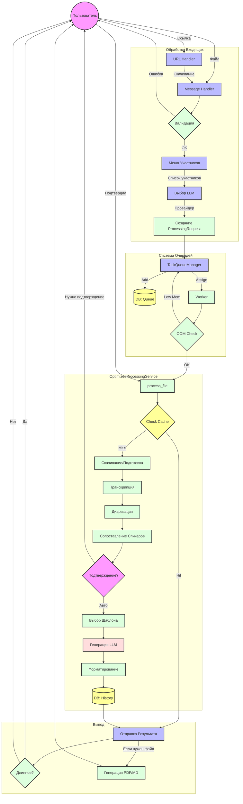

# Пайплайн обработки встречи (Meeting Processing Pipeline)

Этот документ описывает процесс обработки записи встречи в боте Soroka, от получения файла до генерации финального протокола.

## Схема процесса (Mermaid)

## Детальное описание этапов

### 1. Обработка входящих данных (Input Handling)
*   **Точка входа**: `src/handlers/message_handlers.py`
*   **Файлы**: Пользователь отправляет аудио/видео/файл. Бот определяет тип и извлекает `file_id`.
*   **Ссылки**: Пользователь отправляет ссылку (Google Drive/Yandex Disk). Бот скачивает файл во временную директорию.
*   **Валидация**: Проверка размера (до 2GB для Telegram, настройки для внешних) и формата.
*   **Сбор контекста**:
    *   Бот запрашивает список участников через `ParticipantsMenu`.
    *   Бот предлагает выбрать LLM (OpenAI, Anthropic, Yandex) или использует предпочтения пользователя.
*   **Инициализация**: Создается объект `ProcessingRequest` со всеми метаданными (файл, участники, тема, дата).

### 2. Очередь задач (Queue System)
*   **Менеджер**: `src/services/task_queue_manager.py`
*   **Добавление**: Запрос добавляется в `asyncio.Queue` и сохраняется в БД (для надежности при перезапуске).
*   **Воркеры**: Фоновые процессы (`_worker`) разбирают очередь.
*   **Защита ресурсов**: Перед запуском проверяется доступная память (OOM Protection). Если памяти мало, задача возвращается в очередь.
*   **Статус**: Пользователь видит позицию в очереди через `QueueTracker`.

### 3. Обработка (Processing Service)
*   **Ядро**: `src/services/optimized_processing_service.py`
*   **Кеширование**: Вычисляется хеш файла. Если такой файл уже обрабатывался с теми же параметрами, результат возвращается мгновенно из кеша.
*   **Транскрипция**:
    *   Файл конвертируется (если нужно) через `ffmpeg`.
    *   Отправляется в сервис транскрипции (Whisper/Deepgram/etc).
    *   Результат содержит текст и временные метки.
*   **Диаризация**: Разделение текста по спикерам (Speaker 0, Speaker 1...).
*   **Сопоставление спикеров (Speaker Mapping)**:
    *   `src/services/speaker_mapping_service.py` пытается сопоставить "Speaker X" с реальными именами из списка участников, используя LLM.
    *   **UI Подтверждения**: Если включено в настройках, бот присылает пользователю варианты сопоставления. Обработка ставится на паузу (`return None`), состояние сохраняется. После подтверждения процесс возобновляется.
*   **Выбор шаблона**: Если шаблон не выбран явно, `SmartTemplateSelector` анализирует транскрипт и предлагает подходящий.
*   **Генерация протокола**:
    *   Транскрипт + Шаблон + Метаданные отправляются в LLM.
    *   Используется `chain-of-thought` (цепочка рассуждений) для улучшения качества.
*   **Форматирование**: Ответ LLM очищается, форматируется в Markdown. Имена спикеров заменяются на реальные (если есть маппинг).

### 4. Вывод результата (Output)
*   **Отправка**: Результат отправляется пользователю.
*   **Длинные сообщения**: Если протокол длиннее 4096 символов, он разбивается на части.
*   **Файлы**: По настройкам пользователя может быть сгенерирован PDF или MD файл.
*   **История**: Результат сохраняется в историю обработок пользователя в БД.
